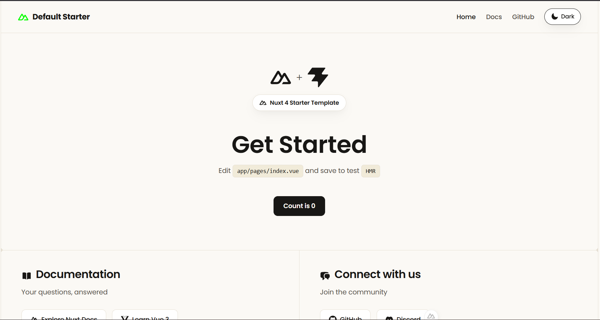

<div align="center">



# Starter Kit Moderen Nuxt

**Opinionated Nuxt starter generator — scaffold project baru dalam hitungan detik.**

[](https://www.npmjs.com/package/create-davingm-nuxt)
[](https://www.npmjs.com/package/create-davingm-nuxt)
[](https://github.com/davingm/nuxt-davingm/actions)
[](./LICENSE)
[](https://nodejs.org)

</div>

---

## Apa ini?

`create-davingm-nuxt` adalah CLI generator untuk membuat project Nuxt baru dengan opinionated setup yang sudah dikurasi. Cukup satu perintah, project siap dengan struktur folder, konfigurasi ESLint, TypeScript, Tailwind CSS, dan banyak lagi.

## Quick Start

Jalankan langsung tanpa install global:

```bash
npx create-davingm-nuxt
```

Atau dengan package manager lain:

```bash
# pnpm
pnpm create davingm-nuxt

# yarn
yarn create davingm-nuxt

# bun
bunx create-davingm-nuxt
```

CLI akan menampilkan prompt interaktif untuk:
1. Memilih **template preset** yang diinginkan
2. Menentukan **lokasi project**
3. Memilih **package manager** (pnpm / npm / yarn / bun)
4. Opsional: **initialize git repository**

## Template Presets

| Preset | Deskripsi |
|--------|-----------|
| `default` | Setup lengkap — Nuxt 4, Tailwind CSS, TypeScript, ESLint, Vitest, dan konfigurasi deployment |
| `minimal` | Setup minimalis — Nuxt tanpa plugin tambahan, cocok untuk prototyping |
| `jawa` | Preset opinionated dengan konfigurasi pribadi Davingm |

## Requirement

- **Node.js** `>= 18.x`
- Salah satu package manager: `npm`, `pnpm`, `yarn`, atau `bun`

## Contributing

Kontribusi sangat disambut! Silakan baca [CONTRIBUTING.md](./CONTRIBUTING.md) untuk panduan lengkapnya.

## Security

Jika menemukan celah keamanan, harap baca [SECURITY.md](./SECURITY.md) sebelum membuat issue publik.

## icense

Dirilis di bawah [MIT License](./LICENSE). © 2026 [Davingm](https://github.com/davingm)

---

<div align="center">
  <sub>Made by <a href="https://davingm.com">Davingm</a> · <a href="https://davingm.com/sponsor">Support the project</a></sub>
</div>
